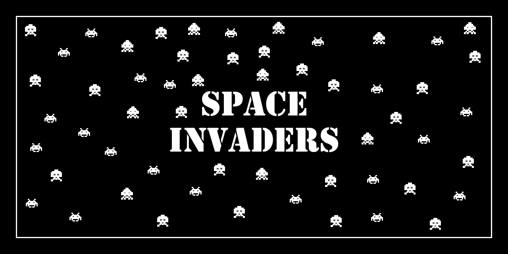

# Resumo
 
 Minha versão do Space Invaders feito como trabalho da disciplina de Programação Orientada a Objetos (SCC0604), lecionada pelo Professor Robson Leonardo Ferreira Cordeiro, para o curso de Engenharia de Computação - USP São Carlos.

## [Space Invaders on Terminal](SpaceInvaders_On_Terminal)

Essa foi a primeira parte do projeto, onde foi criado o esqueleto do nosso jogo. 
Nessa parte todas as estruturas de classes e suas heranças foram criadas e foi iniciado a movimentação de algumas entidadades (Aliens e Nave de Bônus).
O jogo era "impresso" no terminal para ver a implementação das movimentações funcionando.

## [Space Invaders](SpaceInvaders)

A segunda parte do projeto foi implentar, para nossa estrutura já anteriormente implementada, uma interface gráfica utilizando JavaFx. 
Além de terminar o jogo e torna-lo jogável.

 ## License
[MIT License](https://github.com/ISS2718/SpaceInvaders/blob/master/LICENSE) © [Isaac Soares](https://github.com/ISS2718)
